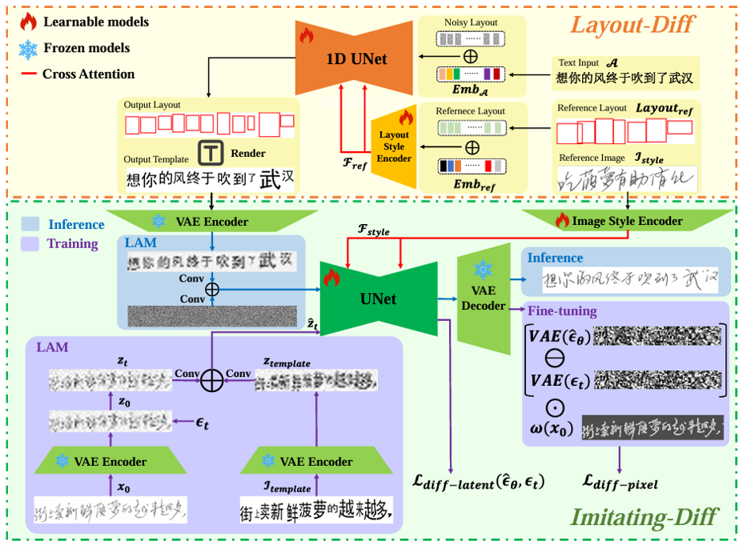
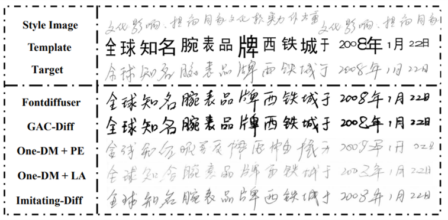
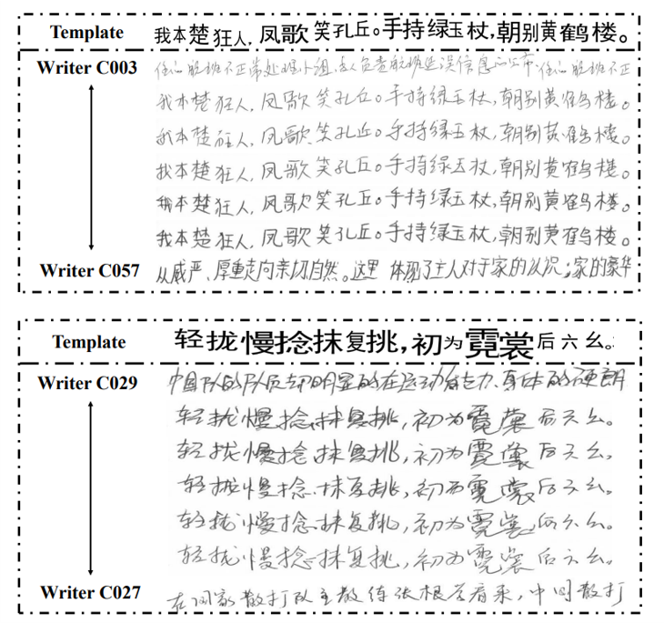
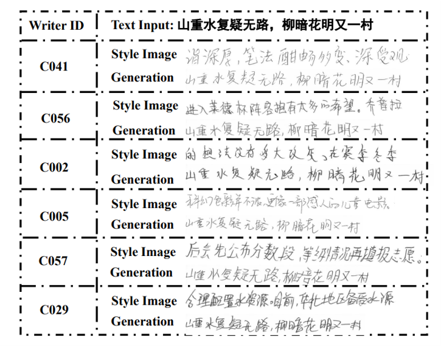

<a href=""></a>
<a href="https://github.com/newbie2niubility/TGC-Diff/blob/main/LICENSE"></a>
  
<h2 align="center">Template-Guided Cascaded Diffusion for Stylized Handwritten Chinese Text-Line Generation</a></h2>

<p align="center">
  🏆 <b>ICDAR 2025 Best Paper Award</b>
</p>

<div align="center">
  <a href="https://link.springer.com/chapter/10.1007/978-3-032-04614-7_9">Paper</a> 
</div>

## 🌟 Introduction
- We propose a novel cascaded diffusion framework designed to disentangle character-level and text-line-level styles. This framework comprises two models: Layout-Diff, which learns spatial styles, and Imitating-Diff, which mimics handwritten styles. These models are systematically integrated through a Template construct.
- We propose a latent aggregation module that integrates content as well as calligraphy style information into Imitating-Diff, effectively preserving the spatial layout and structural coherence of characters within the text-line while imitating the target writing style.
- We refine Imitating-Diff in the pixel space by incorporating a L1 loss weighted by a high-frequency mask, which enhances the clarity of fine-grained character details, thereby improving overall text-line readability.
- Extensive experiments on Chinese handwritten text-line datasets validate the effectiveness of our method, demonstrating robust performance in generating stylized handwriting at the line level. 

<p align="center">

</p>

<p align="center" style="margin-bottom: 10px;">
Overview of the proposed TGC-Diff
</p>

## 🔨 Requirements
```
conda create -n tgc_diff python=3.10 -y
conda activate tgc_diff
# install all dependencies
conda env create -f environment.yml
mkdir .cache
```
## ☀️ Datasets
We provide Chinese text-line datasets in [Baidu Netdisk](https://pan.baidu.com/s/1egncerfRPtaHNi3JYP43cg?pwd=qgd5). Please download these datasets, uzip them and move the extracted files to ./data.

## 🐳 Model Zoo
| Model|Baidu Netdisk|
|---------------|-----------------------------------------|
|Pretrained VAE plus Resnet18|[Baidu Netdisk](https://pan.baidu.com/s/1VwckEw9TN734CirfWvZgiw?pwd=pfl8)|

**Note**:
Please download these weights, and move them to ./.cache.

## 🏋️ Training
- **training on Chinese text-line dataset**
```Shell
sh train.sh
```
- **finetune on Chinese text-line dataset**
```Shell
sh finetune.sh
 ```
**Note**:
Please modify ``--pre_train`` according to your own path.

## 📺 Exhibition
- **Comparisons with other methods on handwritten text-line generation**
<p align="center">

</p>

- **Style interpolation**
<p align="center">

</p>

- **More visualization**
<p align="center">

</p>


## ❤️ Citation
If you find our work inspiring or use our codebase in your research, please cite our work:
```
@InProceedings{TGC-Diff,
author="Wang, Honglie
and Ren, Minsi
and Zhang, Yan-Ming
and Yin, Fei
and Liu, Cheng-Lin",
title="Template-Guided Cascaded Diffusion for Stylized Handwritten Chinese Text-Line Generation",
booktitle="Document Analysis and Recognition -- ICDAR 2025",
year="2025",
publisher="Springer Nature Switzerland",
address="Cham",
pages="149--166",
}
```

